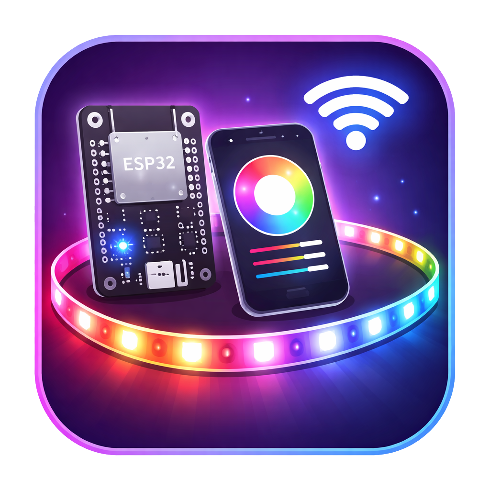

<p align="center">
  
</p>

<h1 align="center">ESP32 LED Controller</h1>

<p align="center">
  A responsive ESP32 web controller for real-time FastLED animations, themed mode orchestration, and stable on-device rendering.
</p>

<p align="center">
  
  
  
  
</p>

---

## Overview

This project combines a modern browser UI with ESP32 firmware to control addressable LED strips over Wi-Fi.

The web layer handles interaction and configuration. The ESP32 handles rendering and timing, so animations continue smoothly even if the browser disconnects.

---

## At a glance

| Area | What you get |
| --- | --- |
| Main controls | Power toggle, live status, standard modes, instant parameter apply |
| Special categories | Ordered submode sequences for Christmas, Fireplace, and Sex Trip |
| Presets | Save/load/delete user presets in browser local storage |
| Runtime model | On-device animation loop with `FastLED.show()` frame updates |
| Access | `http://led.local` via mDNS (or device IP) |

---

## Key features

### Main control interface

- Real-time connection indicator (`/status` polling)
- Power management through `/apply` and `/off`
- Live LED preview canvas with playback control
- Standard effects:
  - Solid
  - Rainbow
  - Wave
  - Fade
  - Strobe
  - Chase
- Per-mode controls (colors, speed, brightness, spacing, direction)
- Instant apply as values change
- Preset management in local storage

### Special modes interface

- Category-based orchestration:
  - Christmas (5 submodes)
  - Fireplace (3 submodes)
  - Sex Trip (3 submodes)
- Enable/disable submodes
- Reorder submodes
- Reset category defaults
- Start ordered submode runs via `/apply?mode=<category>&submodes=...`
- Persistent category settings in `specialModesSettings`

---

## How it works

The ESP32 is the animation engine.

- UI pages are served from LittleFS
- Parameters are sent over HTTP endpoints
- Firmware computes full frames on-device
- LED output remains stable independently of browser connectivity

### Runtime behavior

- Main loop cadence: ~100 Hz (`delay(10)`)
- LEDs off: strip forced to black
- LEDs on:
  - Standard mode: selected effect update each loop
  - Special mode: active submode update each loop
- Frame output: `FastLED.show()` after each update

### Special mode cycling

- Ordered submodes are received from the client
- Firmware rotates submodes automatically every 10 minutes
- `SPECIAL_SUBMODE_DURATION = 600000`

---

## HTTP API

| Endpoint | Method | Description |
| --- | --- | --- |
| `/` | GET | Main UI (`index.html`) |
| `/special.html` | GET | Special modes UI |
| `/status` | GET | Returns `{ isOn, mode }` |
| `/state` | GET | Returns `{ mode, isOn }` |
| `/apply` | GET | Applies mode/settings and turns LEDs on |
| `/off` | GET | Turns LEDs off and clears strip |

### Example requests

```bash
# Solid
http://led.local/apply?mode=solid&color=%23ff0000&brightness=80

# Rainbow
http://led.local/apply?mode=rainbow&speed=40&brightness=90&saturation=100

# Wave
http://led.local/apply?mode=wave&color1=%2300aaff&color2=%23ff00aa&speed=60&length=18

# Ordered special run
http://led.local/apply?mode=christmas&submodes=5,1,3
```

---

## Installation

### Requirements

- ESP32 board
- Addressable LED strip supported by FastLED (default setup targets `WS2813`)
- Appropriate 5V power supply for strip length
- Arduino IDE + ESP32 core

### Required libraries

- `FastLED`
- `ESPAsyncWebServer`
- `AsyncTCP`

Core includes used by firmware:

- `WiFi`
- `ESPmDNS`
- `LittleFS`

### Configure firmware

Edit `leds/leds.ino` before uploading:

- Wi-Fi credentials
- LED hardware configuration

Current defaults:

- `LED_PIN = 4`
- `NUM_LEDS = 88`
- `LED_TYPE = WS2813`
- `COLOR_ORDER = GRB`

### Flash workflow

1. Upload `leds/data` to LittleFS.
2. Upload `leds/leds.ino` to the ESP32.
3. Open Serial Monitor and connect via reported IP or `http://led.local`.

---

## Project structure

```text
ESP32-LED-Controller/
├─ README.md
├─ img/
│  ├─ banner.png
│  └─ logo.png
├─ leds/
│  ├─ leds.ino
│  └─ data/
│     ├─ index.html
│     ├─ script.js
│     ├─ style.css
│     ├─ special.html
│     ├─ special.js
│     └─ special.css
├─ ledsv2.0/
│  └─ data/
└─ tools/
   └─ ESP32FS/
      └─ tool/
```-
---

## Troubleshooting

<details>
<summary><strong>Device does not open at <code>led.local</code></strong></summary>

- Ensure ESP32 and phone/computer are on the same network.
- Check Serial Monitor for assigned IP.
- Try direct access by IP to confirm mDNS resolution issue.

</details>

<details>
<summary><strong>Changes in the web UI do not appear on LEDs</strong></summary>

- Confirm LEDs are powered correctly (including shared ground with ESP32).
- Verify `LED_PIN`, `NUM_LEDS`, strip type, and color order in firmware.
- Confirm `/apply` requests return success.

</details>

<details>
<summary><strong>Special mode does not start</strong></summary>

- Ensure at least one submode is enabled before starting.
- Confirm request format includes `mode=<category>` and `submodes=<list>`.

</details>

---

## Notes for developers

- `/apply` always sets `isOn = true`.
- Special mode labels in UI are presentation names; effect logic lives in `leds.ino`.
- Main UI preview count is frontend-defined and can differ from actual strip length.

---

## Roadmap direction

- Runtime-configurable device/LED profiles
- Configurable special-mode duration
- Unified preview vs hardware LED count
- Persisted on-device configuration UI

---

## License

This project is licensed under the MIT License.

See [LICENSE](LICENSE) for details.
